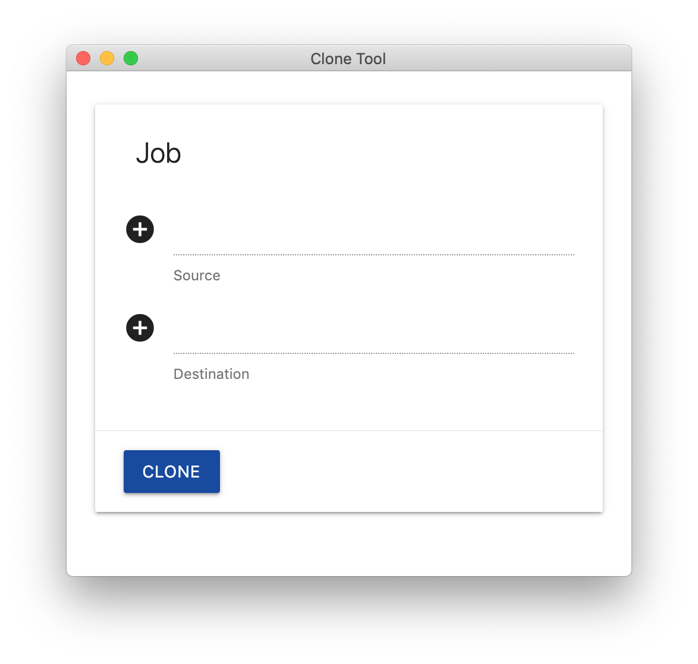

## clone tool

<!-- _One liner + link to confluence page_
_Screenshot of UI - optional_ -->

Inspired by [Davinci Resolve](https://www.blackmagicdesign.com/products/davinciresolve/media)'s [clone tool](https://www.rocketstock.com/blog/davinci-resolves-new-clone-tool-indispensable-dits/)

## Setup

<!-- _stack - optional_
_How to build and run the code/app_ -->

## Usage

## System Architecture

<!-- _High level overview of system architecture_ -->

<!-- ## Documentation

There's a [docs](./docs) folder in this repository.

[docs/notes](./docs/notes) contains dev draft notes on various aspects of the project. This would generally be converted either into ADRs or guides when ready.

[docs/adr](./docs/adr) contains [Architecture Decision Record](https://github.com/joelparkerhenderson/architecture_decision_record).

> An architectural decision record (ADR) is a document that captures an important architectural decision made along with its context and consequences.

We are using [this template for ADR](https://gist.github.com/iaincollins/92923cc2c309c2751aea6f1b34b31d95) -->

## Development env

 <!-- _How to run the development environment_ -->

<!-- - npm > `6.1.0`
- [Node 10 - dubnium](https://scotch.io/tutorials/whats-new-in-node-10-dubnium)

Node version is set in node version manager [`.nvmrc`](https://github.com/creationix/nvm#nvmrc) -->

<!-- _Coding style convention ref optional, eg which linter to use_ -->

<!-- _Linting, github pre-push hook - optional_ -->

## Build

<!-- _How to run build_ -->

## Tests

<!-- _How to carry out tests_ -->

## Deployment

<!-- _How to deploy the code/app into test/staging/production_ -->

<!--

- [ ] add source  [file, or folder]
- [ ] add destination  [ folder only]
- [ ] clone -> copies source to destination
- [ ] checksum source
- [ ] checksum destination
- [ ] compare checksum source and destination
- [ ] return checksum result v or x

- [ ] support copy to multiple destinations

 -->
